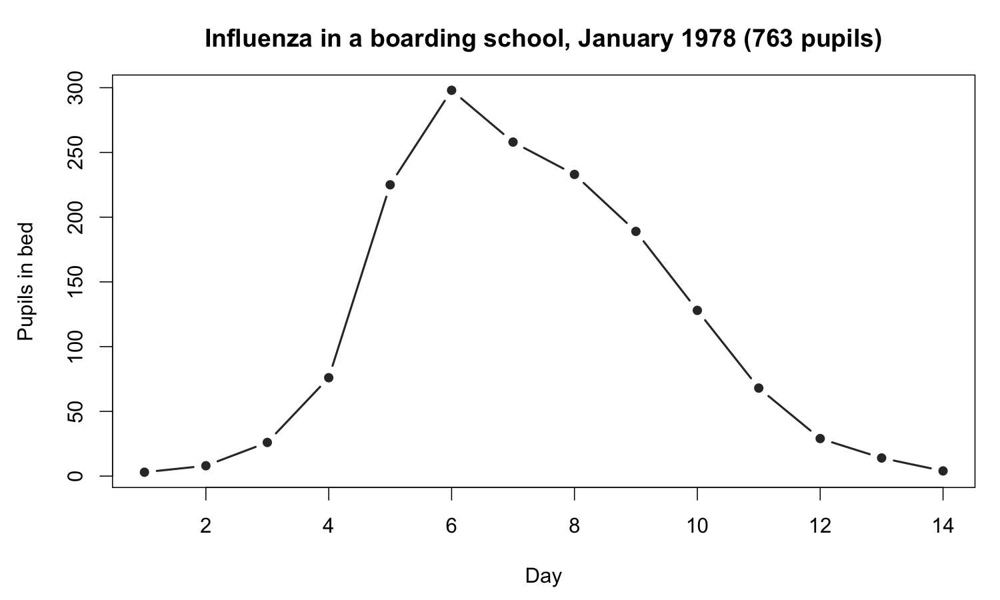
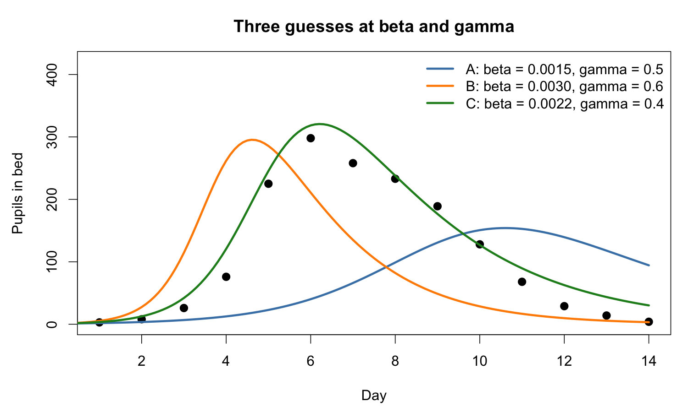

# Introduction & motivation

------------------------------------------------------------------------

## The challenge

:::: {.columns}

::: {.column width="45%"}
- On one side, [data]{style="color: tomato;"} from the real world: case counts, hospital admissions, deaths
- On the other, mathematical [models]{style="color: tomato;"} such as SIR and SEIR
- [**How do we connect the two?**]{style="color: tomato;"}
:::

::: {.column width="55%"}

:::

::::

------------------------------------------------------------------------

## The data we will use today

:::: {.columns}

::: {.column width="45%"}
- Influenza in a boarding school in England, January 1978
- 763 pupils, one of whom brought the virus back from holiday
:::

::: {.column width="55%"}

:::

::::

------------------------------------------------------------------------

## The data we will use today

:::: {.columns}

::: {.column width="45%"}
- The school recorded [how many pupils were in bed each day for 14 days]{style="color: tomato;"}
- Nobody left or arrived, and every case was seen, which makes this [about as clean as outbreak data get]{style="color: tomato;"}
:::

::: {.column width="55%"}

:::

::::

------------------------------------------------------------------------

## The model we will use today {.smaller}

:::: {.columns}

::: {.column width="45%"}
::: {style="color: steelblue;"}
\begin{align}
\frac{dS}{dt} &= -\beta SI \\
\frac{dI}{dt} &= \beta SI - \gamma I \\
\frac{dR}{dt} &= \gamma I
\end{align}
:::
:::

::: {.column width="55%"}
- [$S$, $I$, $R$]{style="color: steelblue;"} count pupils, so [$S + I + R = N = 763$]{style="color: steelblue;"}
- Give the model 762 susceptible pupils and 1 infectious pupil on day 0 and it draws a curve of [$I(t)$]{style="color: steelblue;"} for us to compare with the data
- The quantities we actually want come from these two:
  - [$R_0 = \beta N / \gamma$]{style="color: steelblue;"}, the [basic reproduction number]{style="color: tomato;"}
  - [$1 / \gamma$]{style="color: steelblue;"}, the mean [infectious period]{style="color: tomato;"} in days
- Two unknowns: [$\beta$]{style="color: steelblue;"}, the [transmission rate]{style="color: tomato;"}, and [$\gamma$]{style="color: steelblue;"}, the [recovery rate]{style="color: tomato;"}
:::

::::

------------------------------------------------------------------------

## The calibration problem

------------------------------------------------------------------------

### Parameter estimation and uncertainty quantification

- Some guesses are obviously wrong and some are close, but by eye we cannot rank the close ones. We need a rule that says which is [*best*]{style="color: tomato;"}
- A best guess on its own is worth little without knowing [how sure we can be]{style="color: tomato;"}. Would [$\gamma = 0.4$]{style="color: steelblue;"} have done just as well as [$0.5$]{style="color: steelblue;"}?
- Once we have both, we can estimate [$R_0$]{style="color: steelblue;"}, forecast the second week, or ask what closing the school early would have changed

------------------------------------------------------------------------

::: {.callout-important icon="false"}
### Discussion

- Look at the three guesses again. Which of the two parameters do you think the data pin down better, and why?
- What else could the school have recorded in 1978 that would help us estimate $\gamma$ directly?
:::

------------------------------------------------------------------------

## Approaches to parameter estimation {.smaller}

There are many approaches to answer the question but we'll cover:

1. [**Least squares:**]{style="color: tomato;"} measure how far the curve is from the data and make that distance as small as possible. Simple and fast, but it says nothing reliable about uncertainty
2. [**Maximum likelihood:**]{style="color: tomato;"} measure the *probability* of the data under the model instead. This gives us confidence intervals and a way to compare models
3. [**Bayesian inference:**]{style="color: tomato;"} ask how plausible every value is, rather than which single value is best. This lets us use what we already know, and gives uncertainty that still makes sense for awkward models. The cost is that the answer has to be sampled, with [MCMC]{style="color: tomato;"}

We finish with a short look at what to do when even the [likelihood]{style="color: tomato;"} cannot be written down
