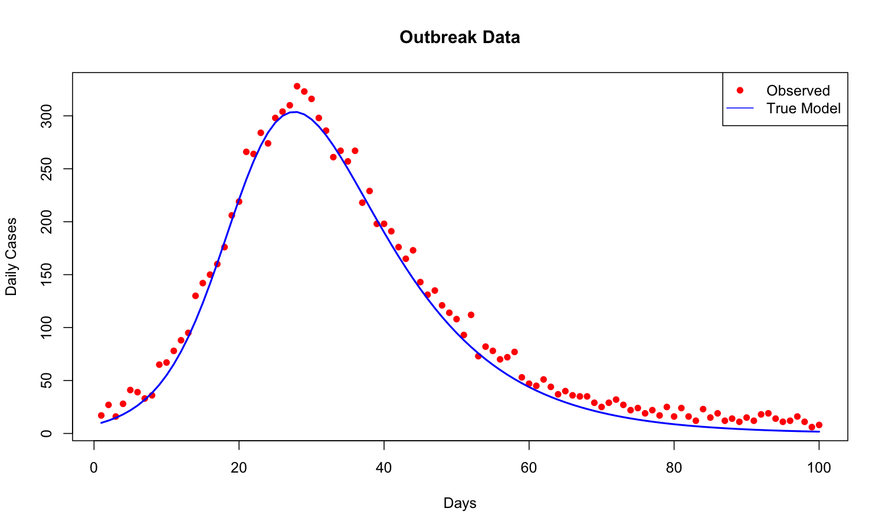

# Introduction & motivation

------------------------------------------------------------------------

## Why model fitting matters

### The challenge

:::: {.columns}

::: {.column width="45%"}
- We have real-world data (case counts, hospitalizations)
- We have mathematical models (e.g., SIR, SEIR)
- [**How do we connect them?**]{style="color: tomato;"}
:::

::: {.column width="55%"}

:::

::::

------------------------------------------------------------------------

### The goal

- Find parameter values that make our model predictions match observed data
- Quantify uncertainty in our estimates
- Make reliable predictions and policy recommendations

------------------------------------------------------------------------

## Example: outbreak data

:::: {.columns}

::: {.column width="45%"}
[**Question:**]{style="color: tomato;"} How do we estimate $\beta$ and $\gamma$ from noisy data?

\begin{align}
\frac{dS}{dt} &= -\beta SI \\
\frac{dI}{dt} &= \beta SI - \gamma I \\
\frac{dR}{dt} &= \gamma I
\end{align}
:::

::: {.column width="55%"}

:::
:::

## Types of fitting methods

### Frequentist methods

- Method of Least Squares
- Maximum Likelihood Estimation (MLE)

------------------------------------------------------------------------

### Bayesian methods

- Markov Chain Monte Carlo (MCMC)
- Sequential Monte Carlo (SMC)
- Particle MCMC (pMCMC)
- Approximate Bayesian Computation (ABC)

[**Today's Focus:**]{style="color: tomato;"} Frequentist methods: Least Squares and Maximum Likelihood Estimation 
