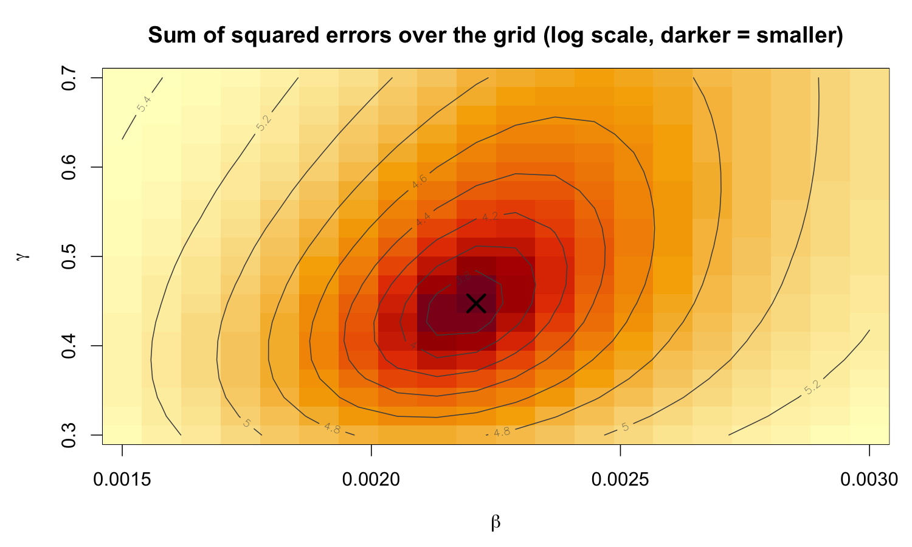
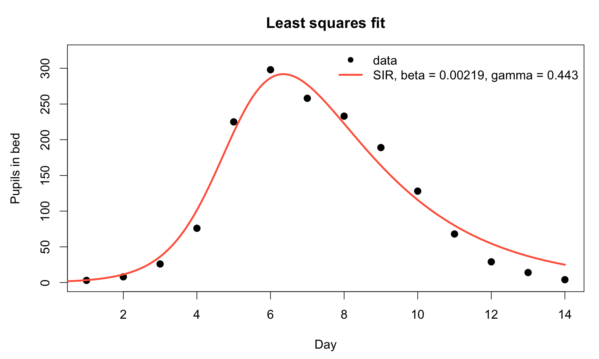

# Least squares estimation

------------------------------------------------------------------------

## Least squares: the intuitive approach

**Core Idea:** Minimize the sum of squared differences between model predictions and observations

------------------------------------------------------------------------

**Mathematical Formulation:** $$\text{SSE} = \sum_{i=1}^{n} (y_i - f(t_i, \theta))^2$$

Where:

- $y_i$ = observed value at time $t_i$
- $f(t_i, \theta)$ = model prediction at time $t_i$
- $\theta$ = parameter vector

------------------------------------------------------------------------

### Why squared errors?

**Advantages:**

- Penalizes large errors more heavily
- Differentiable (smooth optimization)
- Mathematically tractable
- Gives maximum likelihood estimates when errors are normal distributed

------------------------------------------------------------------------

### Disadvantages

- Sensitive to outliers
- Assumes constant variance
- No probabilistic interpretation

------------------------------------------------------------------------

## Least squares for the flu outbreak

### Step 1: the model in code

```{.r include="scripts/00_flu_sir_model.R" snippet="sir_model" code-line-numbers="1|3-10|12-14|16-21"}
```

------------------------------------------------------------------------

### Step 2: the objective function

```{.r include="scripts/03_least_squares.R" snippet="ls_implementation" code-line-numbers="1-7|9-12"}
```

```{.default include="results/03_sse_guesses.txt" code-line-numbers="false"}
```

The numbers agree with our eyes: guess C was closest, guess A was worst

------------------------------------------------------------------------

### Step 3: search

```{.r include="scripts/03_least_squares.R" snippet="ls_grid" code-line-numbers="1-5|7-9|11"}
```

------------------------------------------------------------------------

### The objective function as a landscape



------------------------------------------------------------------------

### Step 4: let an optimiser finish the job

```{.r include="scripts/03_least_squares.R" snippet="ls_optim"}
```

```{.r include="scripts/03_least_squares.R" snippet="ls_results"}
```

```{.default include="results/03_least_squares_fit.txt" code-line-numbers="false"}
```

------------------------------------------------------------------------

### The fit



------------------------------------------------------------------------

## Strengths of least squares

**Computational Advantages:**

- Fast and efficient
- Well-established algorithms
- Easy to implement
- Good for initial parameter estimates

------------------------------------------------------------------------

## Statistical properties

- Unbiased estimates (under certain conditions)
- Minimum variance among linear unbiased estimators
- Maximum likelihood when errors are normal

------------------------------------------------------------------------

## Practical benefits

- Intuitive interpretation
- Widely understood
- Good starting point for more complex methods

------------------------------------------------------------------------

## Limitations of least squares

**Statistical Limitations:**

- Limited uncertainty quantification
- Assumes constant variance
- Sensitive to outliers
- No probabilistic framework

------------------------------------------------------------------------

## Practical limitations

**Practical Limitations:**

- Parameter identifiability issues
- No confidence intervals
- Difficult to compare models
- Assumes measurement error only

------------------------------------------------------------------------

## R implementation practicals {background-color="#447099" transition="fade-in"}

- Let's turn to the [tutorials](https://github.com/GWAC-MPPR/mppr_intro_to_model_fitting_r_practicals)
