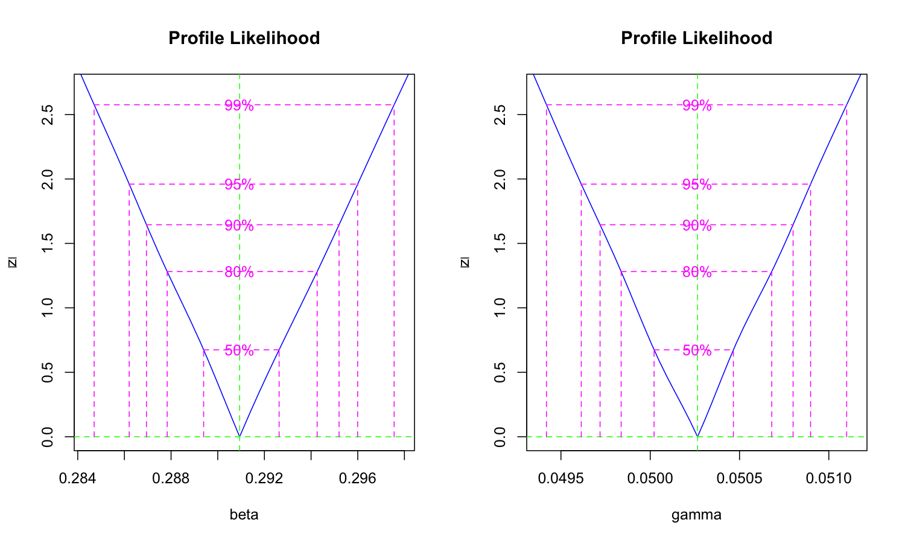
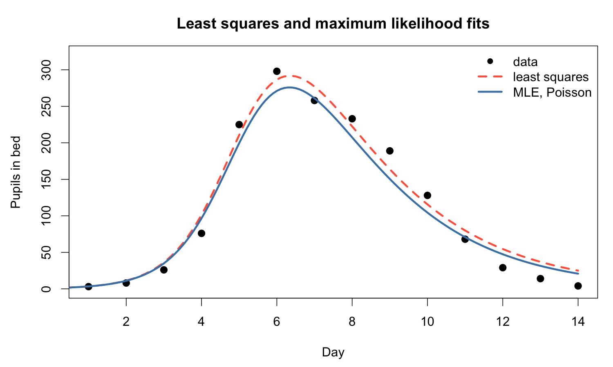

# Maximum likelihood estimation

------------------------------------------------------------------------

## Maximum likelihood: the probabilistic approach

**Core Idea:** Find parameter values that make the observed data most probable

------------------------------------------------------------------------

**Mathematical Formulation:** $$\hat{\theta} = \arg\max_{\theta} L(\theta) = \arg\max_{\theta} \prod_{i=1}^{n} f(y_i | \theta)$$

Where:

- $L(\theta)$ = likelihood function
- $f(y_i | \theta)$ = probability density of observation $i$

------------------------------------------------------------------------

**In Practice:** Maximize log-likelihood $$\hat{\theta} = \arg\max_{\theta} \ell(\theta) = \arg\max_{\theta} \sum_{i=1}^{n} \log f(y_i | \theta)$$

------------------------------------------------------------------------

## Why maximum likelihood?

### Theoretical advantages:

-   Principled statistical framework 
-   Provides uncertainty quantification
-   Enables model comparison (AIC, BIC)
-   Asymptotically optimal properties

------------------------------------------------------------------------

### Practical benefits

-   Confidence intervals
-   Hypothesis testing
-   Model selection
-   Incorporates different error structures

------------------------------------------------------------------------

## Choosing a probability distribution

**For Count Data (e.g., Cases):**

-   **Poisson**: $Y_i \sim \text{Poisson}(\lambda_i)$
-   **Negative Binomial**: $Y_i \sim \text{NB}(\mu_i, \phi)$

------------------------------------------------------------------------

## Choosing a probability distribution

**For Continuous Data:**

-   **Normal**: $Y_i \sim N(\mu_i, \sigma^2)$
-   **Log-normal**: $\log Y_i \sim N(\log \mu_i, \sigma^2)$

::: {.callout-note}
**For Our SIR Example:** We'll use Poisson since we're modeling case counts
:::

------------------------------------------------------------------------

## MLE for the flu outbreak: Poisson likelihood

```{.r include="scripts/04_maximum_likelihood.R" snippet="mle_implementation" code-line-numbers="1-3|4-7"}
```

------------------------------------------------------------------------

### Fitting with `bbmle::mle2()`

```{.r include="scripts/04_maximum_likelihood.R" snippet="mle_fitting" code-line-numbers="1|3-6|8-10"}
```

The least squares estimates are a good place to start the optimiser, which is one of the things least squares is for

------------------------------------------------------------------------

### MLE results

```{.default include="results/04_mle_estimates.txt" code-line-numbers="false"}
```

------------------------------------------------------------------------

## Uncertainty quantification with MLE

```{.r include="scripts/04_maximum_likelihood.R" snippet="mle_uncertainty"}
```



------------------------------------------------------------------------

```{.r include="scripts/04_maximum_likelihood.R" snippet="mle_ci"}
```

```{.default include="results/04_mle_confint.txt" code-line-numbers="false"}
```

------------------------------------------------------------------------

### MLE against least squares

```{.default include="results/04_mle_vs_ls.txt" code-line-numbers="false"}
```

- The two fits are close but not identical, because the Poisson likelihood pays more attention to the small counts at the start and end of the outbreak than squared errors do
- Only the MLE comes with an interval

------------------------------------------------------------------------



------------------------------------------------------------------------

## Model comparison with MLE

```{.r include="scripts/04_maximum_likelihood.R" snippet="model_comparison" code-line-numbers="1-2|3-6"}
```

------------------------------------------------------------------------

```{.r include="scripts/04_maximum_likelihood.R" snippet="model_fit"}
```

------------------------------------------------------------------------

### Model comparison

```{.default include="results/04_model_comparison.txt" code-line-numbers="false"}
```

The negative binomial wins by a wide margin. The counts scatter around the curve more than a Poisson model allows

------------------------------------------------------------------------

## Strengths of maximum likelihood

**Statistical Rigor:**

-   Principled probabilistic framework
-   Asymptotic optimality properties
-   Natural uncertainty quantification
-   Enables formal hypothesis testing

------------------------------------------------------------------------

## Practical benefits

-   Confidence intervals and standard errors
-   Model comparison via AIC/BIC
-   Handles different error structures
-   Extensible to complex models

------------------------------------------------------------------------

## Limitations of maximum likelihood

**Computational Challenges:**

-   More complex than least squares
-   Requires optimization algorithms
-   Can get stuck in local minima
-   Sensitive to starting values

------------------------------------------------------------------------

## Statistical assumptions

-   Requires specification of error distribution
-   Assumes model structure is correct
-   Asymptotic properties may not hold
-   Can be sensitive to outliers

------------------------------------------------------------------------

## Identifiability issues

-   Still suffers from parameter identifiability
-   Profile likelihood can be computationally expensive
-   May not converge for complex models

------------------------------------------------------------------------

## R implementation practicals {background-color="#447099" transition="fade-in"}

-   Let's turn to the [tutorials](https://github.com/GWAC-MPPR/mppr_intro_to_model_fitting_r_practicals)
