# Bayesian inference and MCMC

------------------------------------------------------------------------

## From point estimates to posterior distributions

### Point estimation: least squares and maximum likelihood

- One [best]{style="color: tomato;"} value for each parameter, [$\hat{\theta}$]{style="color: steelblue;"}
- Uncertainty came afterwards, from [standard errors]{style="color: tomato;"} or the [profile likelihood]{style="color: tomato;"}

------------------------------------------------------------------------

### The Bayesian formulation

So far we have asked *which* [$\theta$]{style="color: steelblue;"} fits best.

A Bayesian asks

["How plausible is each value of $\theta$, given the data?"]{style="color: tomato;"}

- The answer is a [probability distribution]{style="color: tomato;"} over [$\theta$]{style="color: steelblue;"}
- Every estimate, interval and prediction we report comes from that one distribution

------------------------------------------------------------------------

## Bayesian inference is reallocation of credibility {.smaller}

::::: columns
::: {.column width="42%"}
- Before we see any data, each possible value of [$\theta$]{style="color: steelblue;"} has some [prior]{style="color: tomato;"} credibility
- The data then make some values more believable and others less
- [Bayes' rule]{style="color: tomato;"} is the rule for moving credibility towards the values that explain the data well
:::

::: {.column width="58%"}
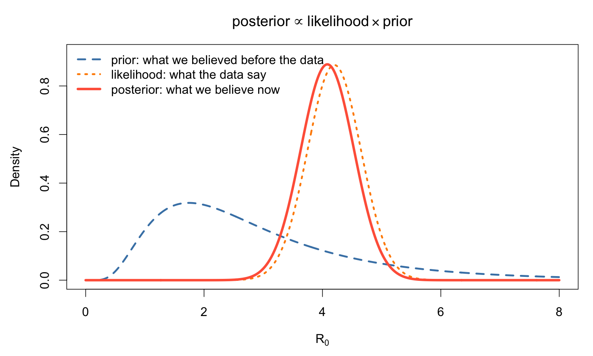
:::
:::::

------------------------------------------------------------------------

## Bayes' rule

::: {style="color: steelblue;"}
$$p(\theta \mid y) = \frac{p(y \mid \theta)\, p(\theta)}{p(y)}$$
:::

- [$p(\theta)$]{style="color: steelblue;"} is the [prior]{style="color: tomato;"}, what we believed before seeing the data $y$
- [$p(y \mid \theta)$]{style="color: steelblue;"} is the [likelihood]{style="color: tomato;"}, the same function we maximised in the MLE section
- [$p(\theta \mid y)$]{style="color: steelblue;"} is the [posterior]{style="color: tomato;"}, what we believe now
- [$p(y)$]{style="color: steelblue;"} is a [normalising constant]{style="color: tomato;"}. It is the same number for every [$\theta$]{style="color: steelblue;"}, so it does not change the shape of the posterior

::: {style="color: steelblue;"}
$$\text{posterior} \propto \text{likelihood} \times \text{prior}$$
:::

------------------------------------------------------------------------

## The prior

### Sources of prior information

- [Earlier outbreaks and the literature]{style="color: tomato;"}, for example the infectious period of influenza
- [Constraints]{style="color: tomato;"}: rates are positive, proportions lie between 0 and 1
- [Expert judgement]{style="color: tomato;"}: what the people who know the disease think

------------------------------------------------------------------------

### Types of priors: vague and informative priors

- A [vague]{style="color: tomato;"} prior spreads credibility widely and leaves the work to the data
- An [informative]{style="color: tomato;"} prior writes down what we already know. It matters most when the data are thin
- Either way the prior is part of the model, so [say what it is, and check what it implies]{style="color: tomato;"}

------------------------------------------------------------------------

### Prior predictive checks

:::::: {style="font-size: 0.8em;"}
::::: columns
::: {.column width="42%"}
- Nobody has intuition for a prior on [$\beta$]{style="color: steelblue;"}. Everybody has intuition for an epidemic curve
- So [draw parameter values from the prior, run the model]{style="color: tomato;"}, and look at the epidemics it produces
- If half of them put the whole school in bed by day two, the prior is telling you something you did not intend
:::

::: {.column width="58%"}
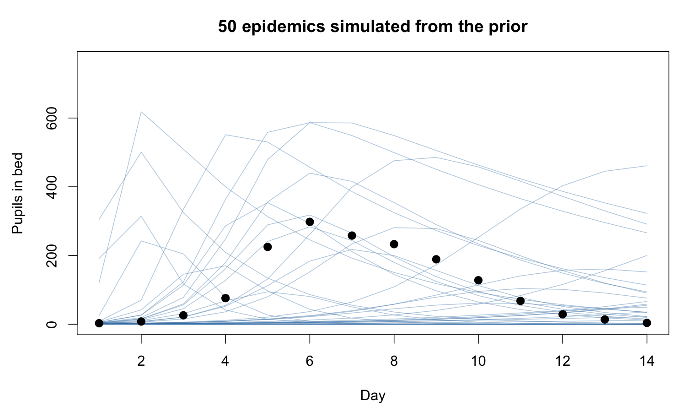
:::
:::::
::::::

------------------------------------------------------------------------

## {background-color="#447099" transition="fade-in"}

::: {.callout-important icon="false"}
### Discussion

- What prior would you put on the infectious period of influenza? Of Ebola? Where would you get it from?
- Is a prior that puts the whole school in bed by day two "wrong", or just vague?
:::

------------------------------------------------------------------------

## The posterior

### Posterior summaries: point estimates

::: {style="font-size: 0.75em;"}
::::: columns
::: {.column width="38%"}
- If you want a single number, the posterior gives you three to choose from: the [mode]{style="color: tomato;"}, the [median]{style="color: tomato;"} and the [mean]{style="color: tomato;"}
- They agree when the posterior is symmetric and differ when it is skewed, as it usually is for a rate
- The [median is the usual choice]{style="color:tomato"}: it does not move when the tail is long
:::

::: {.column width="62%"}
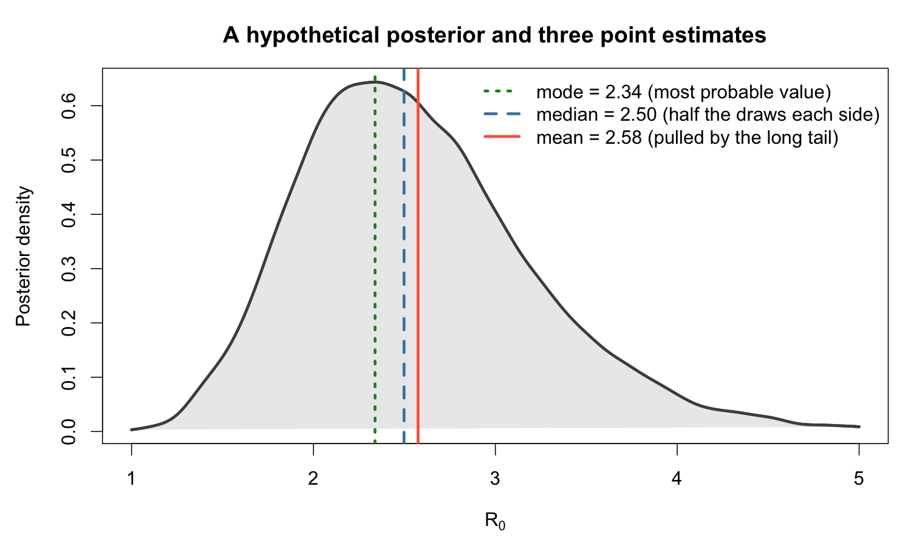
:::
:::::
:::

------------------------------------------------------------------------

### Posterior summaries: credible intervals

::: {style="font-size: 0.75em;"}
::::: columns
::: {.column width="38%"}
- A [95% credible interval]{style="color: tomato;"} is the range holding 95% of the posterior probability, here the 2.5% and 97.5% quantiles
- You can read it literally: ["there is a 95% probability that $R_0$]{style="color: tomato;"} lies between [1.5 and 4.1]{style="color: steelblue;"}"
- A confidence interval is rather a statement about repeated sampling, not about [$R_0$]{style="color: steelblue;"}
:::

::: {.column width="62%"}
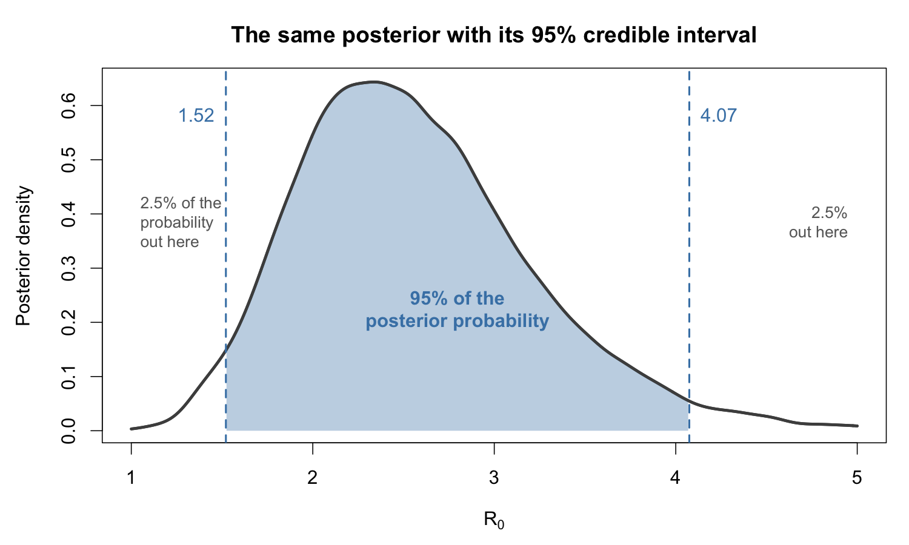
:::
:::::
:::

------------------------------------------------------------------------

### Posterior summaries: derived quantities

::: {style="font-size: 0.75em;"}
::::: columns
::: {.column width="38%"}
- We sample [$\beta$]{style="color: steelblue;"} and [$\gamma$]{style="color: steelblue;"}, but what we want is [$R_0 = \beta N / \gamma$]{style="color: steelblue;"}
- Compute it for every draw and you have its posterior, [correlation between the parameters]{style="color:tomato"} included, at no extra cost
- The same goes for the infectious period, the peak size, or the final attack rate
:::

::: {.column width="62%"}
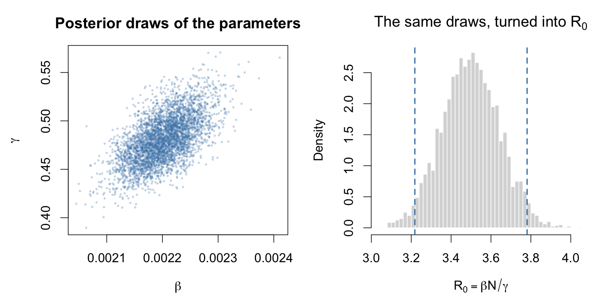
:::
:::::
:::

------------------------------------------------------------------------

### Posterior summaries: predictions

::: {style="font-size: 0.75em;"}
::::: columns
::: {.column width="38%"}
- Run the model [once for each draw]{style="color:tomato"} and you get a whole [family of epidemic curves]{style="color:tomato"} rather than one
- Their spread is the [prediction uncertainty]{style="color: tomato;"} that comes from not knowing the parameters exactly
- [Summarise them]{style="color:tomato"} as a median curve and a 95% band, and compare the band with the data
:::

::: {.column width="62%"}
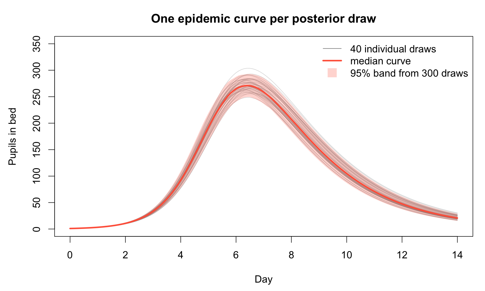
:::
:::::
:::

------------------------------------------------------------------------

## The posterior is intractable

### The normalising constant

::: {style="color: steelblue;"}
$$p(y) = \int p(y \mid \theta)\, p(\theta)\, d\theta$$
:::

- This is an [integral over every combination of parameter values]{style="color: tomato;"}, and for an ODE model there is [no formula for it]{style="color:tomato"}.
- What we *can* do is evaluate [$p(y \mid \theta)\, p(\theta)$]{style="color: steelblue;"} at any [$\theta$]{style="color: steelblue;"} we like, which gives us the posterior [up to that unknown constant]{style="color: tomato;"}

------------------------------------------------------------------------

### The obvious approach: evaluate the posterior on a grid

::: {style="font-size: 0.8em;"}
::::: columns
::: {.column width="38%"}
- We cannot integrate the posterior, but we can [evaluate it anywhere]{style="color: tomato;"}
- So choose a set of values for [$\beta$]{style="color: steelblue;"}, run the model at each, and record [$p(y \mid \beta)\, p(\beta)$]{style="color: steelblue;"}
- With [$\gamma$]{style="color: steelblue;"} held fixed, 15 values means [15 model runs]{style="color: tomato;"}, and the shape of the posterior appears
:::

::: {.column width="62%"}
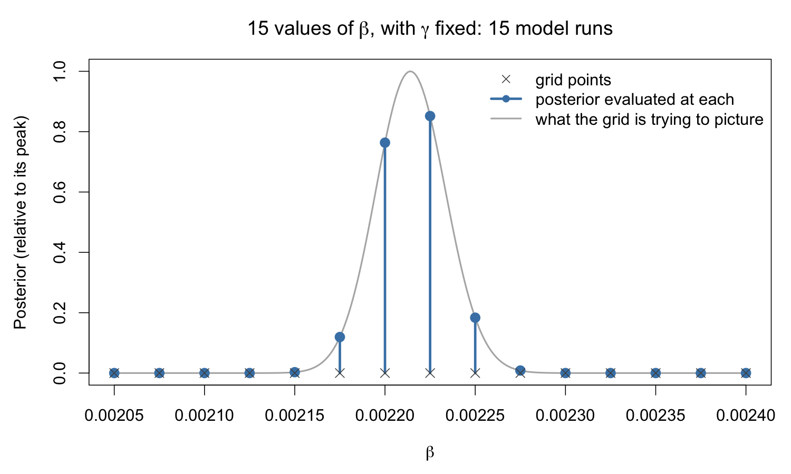
:::
:::::
:::

------------------------------------------------------------------------

### Two parameters: a grid of grids

::: {style="font-size: 0.8em;"}
::::: columns
::: {.column width="38%"}
- Now let [$\gamma$]{style="color: steelblue;"} vary too: 15 values of each, so every value of [$\beta$]{style="color: steelblue;"} is paired with every value of [$\gamma$]{style="color: steelblue;"}
- That is [$15 \times 15 = 225$]{style="color: steelblue;"} combinations, and [225 model runs]{style="color: tomato;"}
- A third parameter would multiply that by 15 again: a cube of [3,375]{style="color: steelblue;"} points
:::

::: {.column width="62%"}
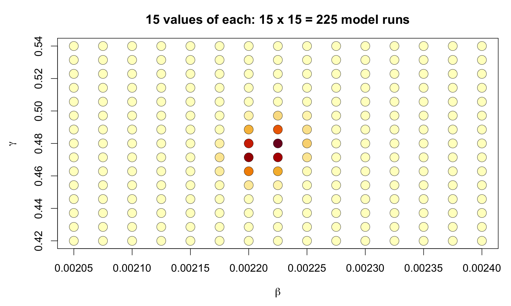
:::
:::::
:::

------------------------------------------------------------------------

### Every extra parameter multiplies the cost by 15

```{.default include="results/06_grid_cost.txt" code-line-numbers="false"}
```

- The number of runs is [$15^p$]{style="color: steelblue;"} for [$p$]{style="color: steelblue;"} parameters: this is the [curse of dimensionality]{style="color: tomato;"}
- With two parameters a grid is a fine way to *look at* the posterior; an SEIR model with reporting and a latent period has six or more, and is [out of the question]{style="color: tomato;"}

------------------------------------------------------------------------

### Grid evaluation for the influenza outbreak

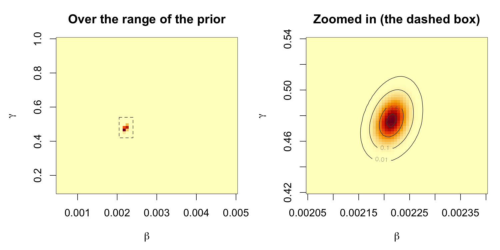

- Worse, a grid spends its runs evenly, and the posterior is not spread evenly: over the range of the prior, [3,600]{style="color: steelblue;"} runs and [nearly all of them landed where the posterior is zero]{style="color: tomato;"}
- What we want is a method that spends its model runs [where the posterior is large]{style="color: tomato;"}, and that is what MCMC does

------------------------------------------------------------------------

## {background-color="#447099" transition="fade-in"}

::: {.fragment style="font-size: 450%; color: white;"}
Any Questions?
:::

------------------------------------------------------------------------

## Monte Carlo estimation {.smaller}

::::: columns
::: {.column width="42%"}
- If you want the mean height of the people of Kumasi you do not measure everyone. You measure a [sample]{style="color: tomato;"}
- A posterior can be treated the same way. Given enough draws of [$\theta$]{style="color: steelblue;"}, the [mean, the quantiles and the histogram of the sample]{style="color: tomato;"} are as good as the real thing
:::

::: {.column width="58%"}
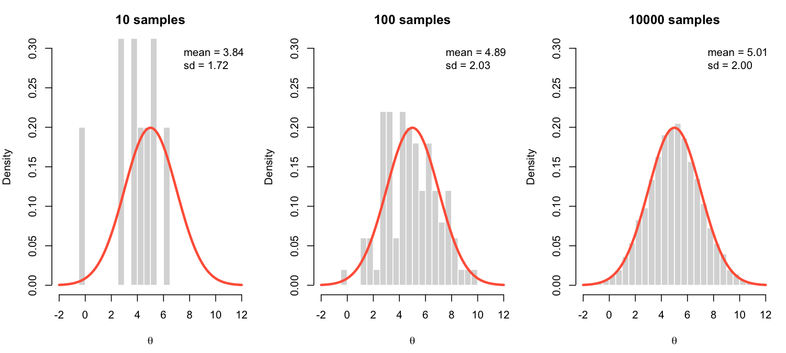
:::
:::::

------------------------------------------------------------------------

### Two things you can do with a distribution

::: {style="font-size: 0.8em;"}
| | [Evaluate]{style="color: tomato;"} it at a point | [Sample]{style="color: tomato;"} from it |
|---|---|---|
| [$N(5, 2)$]{style="color: steelblue;"} | `dnorm(6, 5, 2)` gives 0.176 | `rnorm(3, 5, 2)` gives 6.3, 4.1, 7.8 |
| The posterior | `log_posterior(theta)`: one model run | there is no `rposterior()` |

- R provides both for the familiar distributions, so we never notice they are different abilities
- For the posterior we have only the first: any [$\theta$]{style="color: steelblue;"} can be scored, up to the constant [$p(y)$]{style="color: steelblue;"}
- No function returns random draws from *this* posterior: it has no formula, it is whatever shape the model, the likelihood and the prior produce together
:::

------------------------------------------------------------------------

### Sampling from an unnormalised density

- Monte Carlo needs [samples]{style="color: tomato;"}: a bag of draws of [$\theta$]{style="color: steelblue;"} from which means, intervals and predictions are read off
- All we have is the ability to [evaluate]{style="color: tomato;"}: to score any candidate [$\theta$]{style="color: steelblue;"} and say how plausible it is relative to any other

[**How do you draw samples from something you can only evaluate?**]{style="color: tomato;"}

The answer is to stop trying to draw independent samples at all, and instead to walk through parameter space one step at a time, deciding each step from the scores of two candidates. The rest of this section is that walk

------------------------------------------------------------------------

## Markov chain Monte Carlo {.smaller}

[**Core idea:**]{style="color: tomato;"} generate the samples one after another as a [chain]{style="color: tomato;"}, where each new value depends only on the one before it (that is what *Markov* means), and set up the rule for the next step so that the chain spends time in each region in proportion to the posterior density

- Start somewhere. Propose a small move. Accept or reject it depending on how the posterior changes. Repeat
- Run it long enough and the values in the chain are draws from the posterior, and we [never had to compute $p(y)$]{style="color: tomato;"}
- The original version is the [Metropolis algorithm]{style="color: tomato;"}, which is what we build next

------------------------------------------------------------------------

## The Metropolis algorithm {.smaller}

::::: columns
::: {.column width="50%"}
1.  Start at some [$\theta^{(0)}$]{style="color: steelblue;"}
2.  Propose [$\theta^* = \theta + \varepsilon$]{style="color: steelblue;"}, where [$\varepsilon$]{style="color: steelblue;"} comes from a [symmetric]{style="color: tomato;"} proposal distribution such as [$N(0, \sigma^2)$]{style="color: steelblue;"}
3.  Compute [$r = \dfrac{p(\theta^* \mid y)}{p(\theta \mid y)}$]{style="color: steelblue;"}. The constant [$p(y)$]{style="color: steelblue;"} appears top and bottom and [cancels]{style="color: tomato;"}
4.  Draw [$u \sim U(0, 1)$]{style="color: steelblue;"}. If [$u < r$]{style="color: steelblue;"} [accept]{style="color: tomato;"} the move ([$\theta \leftarrow \theta^*$]{style="color: steelblue;"}); otherwise [stay where you are]{style="color: tomato;"}
5.  Record [$\theta$]{style="color: steelblue;"} and go back to step 2
:::

::: {.column width="50%"}
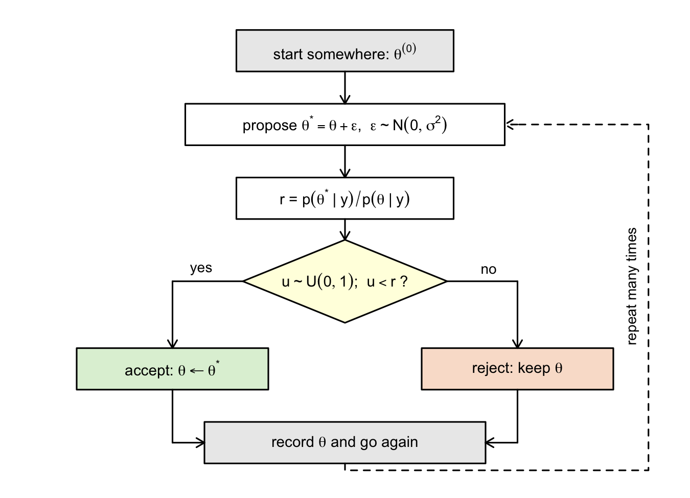
:::
:::::

------------------------------------------------------------------------

### The acceptance rule

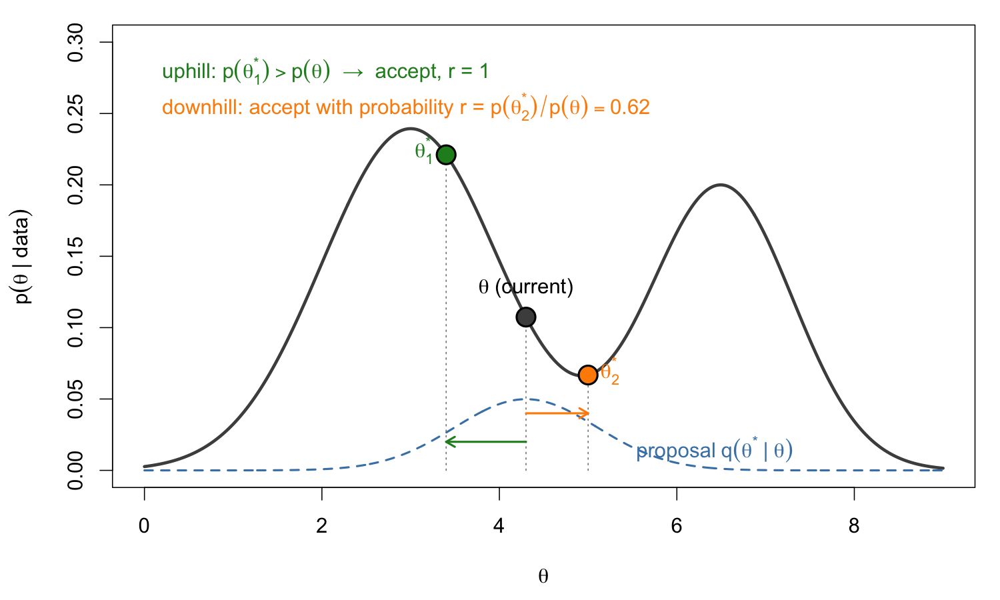

------------------------------------------------------------------------

### Consequences of the acceptance rule

- If the proposal has higher posterior density than where we are, we [always]{style="color: tomato;"} take it
- If it has lower density we take it [with probability $r$]{style="color: tomato;"}. The chain can walk downhill, which is why it explores the distribution instead of climbing to the top and staying there
- When a proposal is rejected the current value is [written down again]{style="color: tomato;"}. Those repeats are part of the sample, so do not throw them away
- Put together, the chain visits each region [in proportion to its posterior density]{style="color: tomato;"}

------------------------------------------------------------------------

### Detailed balance and the stationary distribution

::: {style="font-size: 0.8em;"}
- The acceptance rule gives the chain [detailed balance]{style="color: tomato;"}: as much probability flows from $\theta$ to $\theta^*$ as flows back, so nothing piles up anywhere [$$p(\theta \mid y)\, q(\theta^* \mid \theta)\, \alpha(\theta, \theta^*) = p(\theta^* \mid y)\, q(\theta \mid \theta^*)\, \alpha(\theta^*, \theta)$$]{style="color: steelblue;"}
- [$\alpha = \min(1, r)$]{style="color: steelblue;"} is the smallest correction that makes this hold
- The posterior is then the chain's [stationary distribution]{style="color: tomato;"}. Run it long enough and its values are posterior draws
- With an asymmetric proposal the ratio needs a correction. That is [Metropolis–Hastings]{style="color: tomato;"}: [$$r = \frac{p(\theta^* \mid y)\, q(\theta \mid \theta^*)}{p(\theta \mid y)\, q(\theta^* \mid \theta)}$$]{style="color: steelblue;"}
:::

------------------------------------------------------------------------

### Implementation in R

``` {.r include="scripts/06_mcmc_schematics.R" snippet="metropolis_1d" code-line-numbers="1-5|7-9|10-16|17-18|20"}
```

Everything is done on the [log scale]{style="color: tomato;"}, so the products become sums and the tiny likelihoods do not underflow to zero

------------------------------------------------------------------------

### Validation on a known target distribution

The sampler knows nothing about Bayes. It will sample from anything you can evaluate, so try it first on [$N(5, 2)$]{style="color: steelblue;"}, where we know what the answer should look like.

``` {.r include="scripts/06_mcmc_schematics.R" snippet="metropolis_normal"}
```

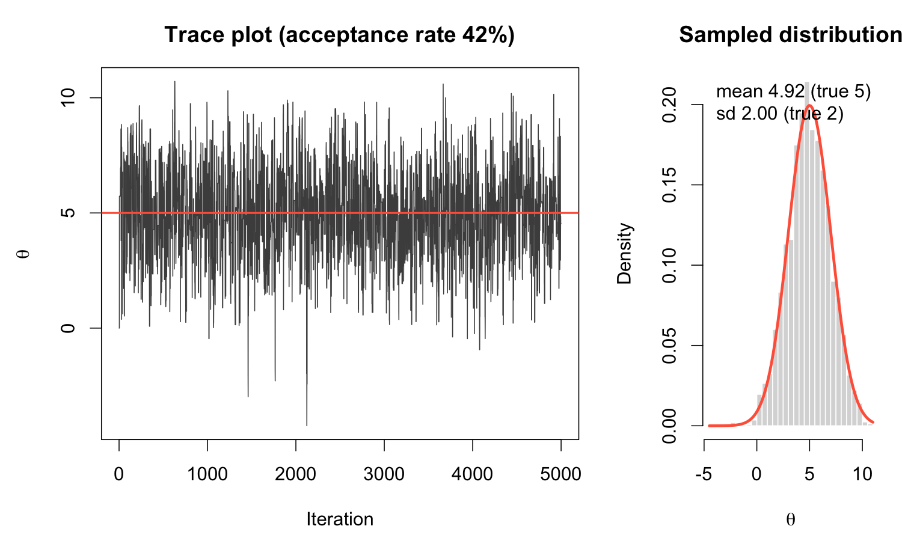

------------------------------------------------------------------------

## {background-color="#447099" transition="fade-in"}

::: {.fragment style="font-size: 450%; color: white;"}
Any Questions?
:::

------------------------------------------------------------------------

## Practical implementation

### Tuning the proposal

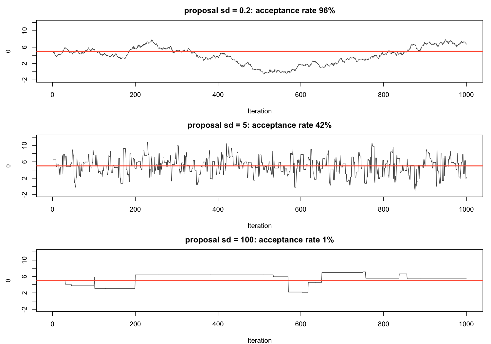

------------------------------------------------------------------------

### Proposal scale and acceptance rate

- Make the proposal [too narrow]{style="color: tomato;"} and nearly every move is accepted, but each move is tiny and the chain crawls
- Make it [too wide]{style="color: tomato;"} and nearly every move is rejected, so the chain sits still for long stretches
- For a random walk proposal, aim for an acceptance rate of about [44% with one parameter, down to about 23% with many]{style="color: tomato;"}
- If the parameters are [correlated]{style="color: tomato;"} in the posterior, the proposal should be correlated the same way

------------------------------------------------------------------------

### Burn-in

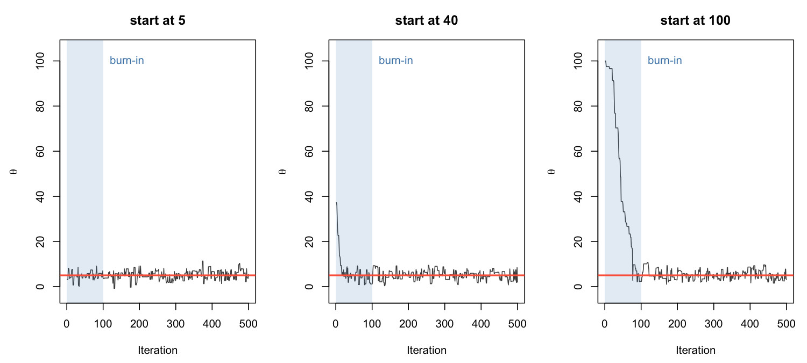

- We chose the starting point, so the first part of the chain says more about that choice than about the posterior
- Throw those early samples away. This is the [burn-in]{style="color: tomato;"}. Discarding a few extra costs little, and starting from a sensible place such as the MLE shortens it
- How much to discard is decided [after looking at the chain]{style="color: tomato;"}, never before

------------------------------------------------------------------------

### Convergence assessment with multiple chains

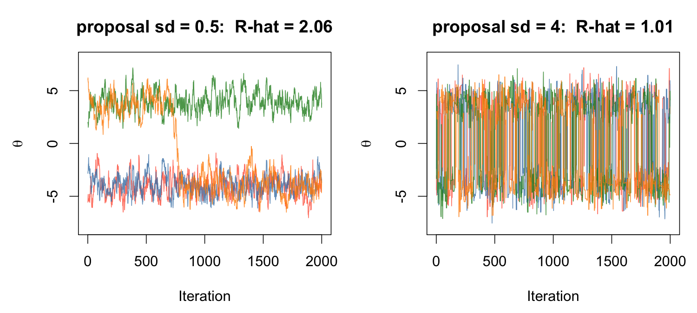

------------------------------------------------------------------------

### Convergence diagnostics

::: {style="font-size: 0.8em;"}
- A single chain cannot tell you about the places it has never been
- So start [several chains far apart]{style="color: tomato;"}. If they end up indistinguishable, they have found the same distribution
- [$\hat{R}$]{style="color: tomato;"} turns that into a number by comparing the variance between chains with the variance within them. We want [$\hat{R}$ below 1.01]{style="color: steelblue;"}
- Consecutive draws are correlated, so 20,000 of them carry less information than 20,000 independent draws would. The [effective sample size]{style="color: tomato;"} is the number that matters

``` {.r include="scripts/06_mcmc_schematics.R" snippet="rhat"}
```
:::

------------------------------------------------------------------------

### Convergence checklist

- The [trace plots]{style="color: tomato;"} show no trend, the same spread at the start as at the end, and the chains lie on top of each other
- The [acceptance rate]{style="color: tomato;"} is in a sensible range
- [$\hat{R}$]{style="color: steelblue;"} is close to 1 and the [effective sample size]{style="color: tomato;"} is in the hundreds at least
- [Any of these checks can show you a problem. None of them can prove there is not one]{style="color: tomato;"}

------------------------------------------------------------------------

## {background-color="#447099" transition="fade-in"}

::: {.fragment style="font-size: 450%; color: white;"}
Any Questions?
:::

------------------------------------------------------------------------

## {background-color="#447099" transition="fade-in"}

::: {.callout-important icon="false"}
### Discussion

- You run one chain for a million iterations and its trace plot looks perfect. What can it still not tell you?
- The acceptance rate is 95%. Is that good news?
:::

------------------------------------------------------------------------

## MCMC for the 1978 influenza outbreak

The data, the model and `predict_cases()` are the ones from the least squares and MLE sections. From here on we do something different with the [likelihood]{style="color: tomato;"}

------------------------------------------------------------------------

### Prior, likelihood, posterior

``` {.r include="scripts/06_mcmc_flu.R" snippet="flu_posterior" code-line-numbers="1|3-8|10-15|17-18"}
```

------------------------------------------------------------------------

### The multivariate Metropolis sampler

``` {.r include="scripts/06_mcmc_flu.R" snippet="metropolis" code-line-numbers="1-6|8-10|11-15|16|18"}
```

------------------------------------------------------------------------

### Adaptive tuning and multiple chains

``` {.r include="scripts/06_mcmc_flu.R" snippet="flu_pilot" code-line-numbers="1-4|6-7"}
```

``` {.r include="scripts/06_mcmc_flu.R" snippet="flu_chains" code-line-numbers="1-6|7-8|9-10"}
```

------------------------------------------------------------------------

### Convergence diagnostics for the influenza fit

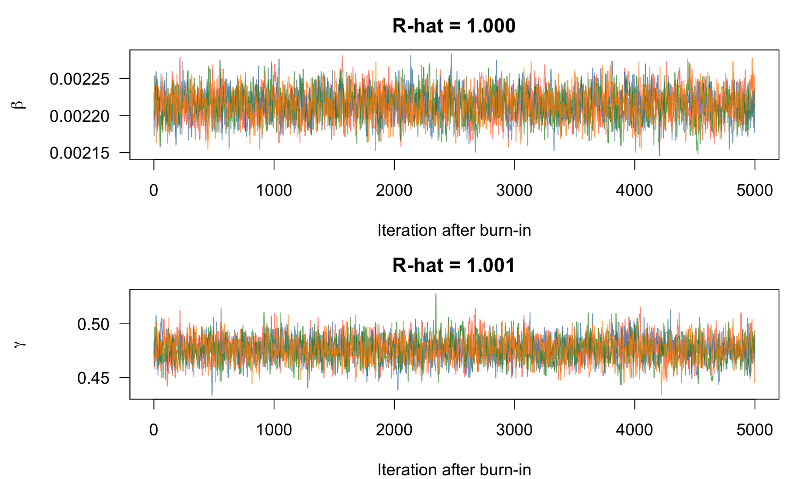

------------------------------------------------------------------------

### Marginal and joint posterior distributions

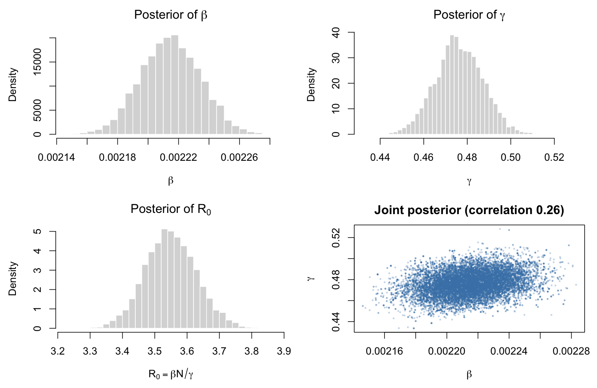

------------------------------------------------------------------------

### Posterior estimates

``` {.default include="results/06_flu_mcmc_summary.txt" code-line-numbers="false"}
```

------------------------------------------------------------------------

### Posterior predictive fit

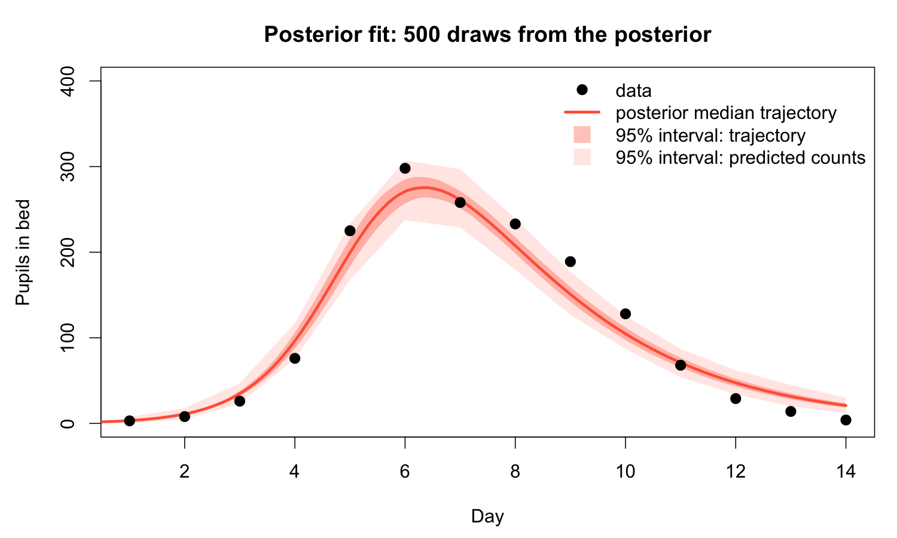

------------------------------------------------------------------------

## {background-color="#447099" transition="fade-in"}

::: {.callout-important icon="false"}
### Discussion

- The 95% credible interval for $R_0$ is 3.40 to 3.71. What does that interval assume, and what could make it wrong?
- The posterior predictive band misses the peak. Which of the sources of uncertainty from section 2 is the model missing?
:::

------------------------------------------------------------------------

## Beyond the Metropolis algorithm {.smaller}

- [Metropolis-within-Gibbs]{style="color: tomato;"} updates one parameter, or one block of parameters, at a time, which helps when the parameters are correlated
- [Adaptive MCMC]{style="color: tomato;"} learns the proposal covariance from the chain while it runs, so you do not have to tune it by hand
- [Hamiltonian Monte Carlo]{style="color: tomato;"}, and its self-tuning version NUTS, uses the gradient of the log posterior to propose long moves in a sensible direction. It is the default sampler in Stan
- [Particle MCMC]{style="color: tomato;"} is for stochastic models, where the likelihood itself has to be estimated by simulation. That is the next section

------------------------------------------------------------------------

### Probabilistic programming languages

- You write down the [model, the prior and the likelihood]{style="color: tomato;"}. The software does the sampling and reports the diagnostics
- Stan (through `rstan` or `cmdstanr`), `nimble`, `brms`, PyMC and Turing.jl all work this way

------------------------------------------------------------------------

### Example: the SIR model in Stan

``` {.stan include="scripts/06_sir_model.stan" code-line-numbers="1-13|15-22|24-28|30-38|40-45|47-50"}
```

------------------------------------------------------------------------

## The Bayesian workflow

1.  Write down the [model and the prior]{style="color: tomato;"}, and check the prior by simulating from it
2.  Write down the [likelihood]{style="color: tomato;"}, that is, how the data arise from the model
3.  [Sample the posterior]{style="color: tomato;"} with MCMC, using several chains started far apart
4.  [Check the chains]{style="color: tomato;"}: trace plots, acceptance rate, [$\hat{R}$]{style="color: steelblue;"}, effective sample size
5.  [Summarise the posterior]{style="color: tomato;"}: means, credible intervals, and derived quantities such as [$R_0$]{style="color: steelblue;"}
6.  [Check the fit]{style="color: tomato;"} by plotting posterior predictions against the data

------------------------------------------------------------------------

## {background-color="#447099" transition="fade-in"}

::: {.fragment style="font-size: 450%; color: white;"}
Any Questions?
:::

------------------------------------------------------------------------

## R implementation practicals {background-color="#447099" transition="fade-in"}

#### R Practicals

- Fit the SIR model to the influenza data with a Metropolis sampler you write yourself, following [`02_mcmc_practicals.qmd`](https://github.com/GWAC-MPPR/mppr_intro_to_model_fitting_r_practicals/tree/main/practicals)

- Download the file `Day05-pack` from Moodle or clone it from GitHub using the following command in your terminal

``` bash
git clone \
https://github.com/GWAC-MPPR/mppr_intro_to_model_fitting_r_practicals.git
```

